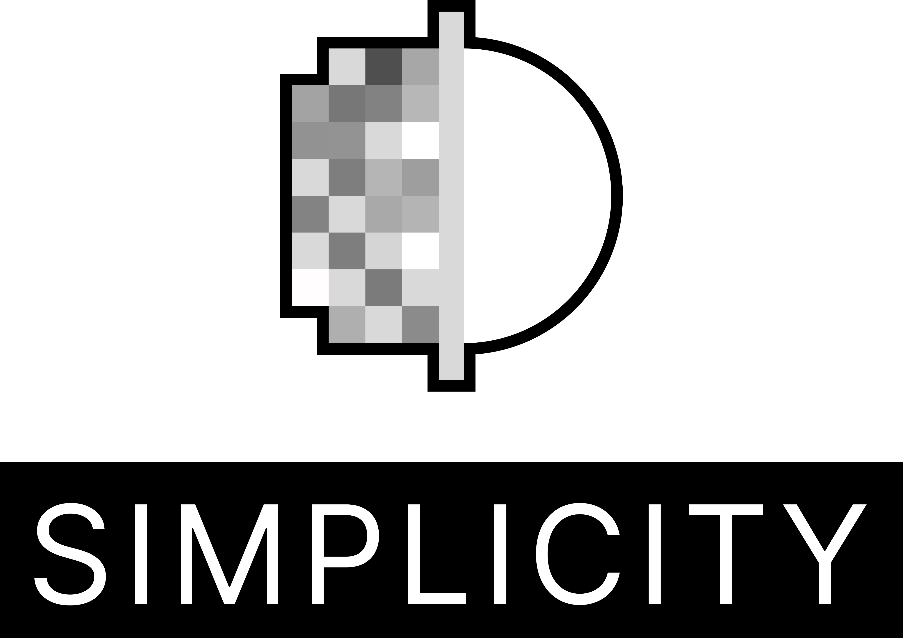
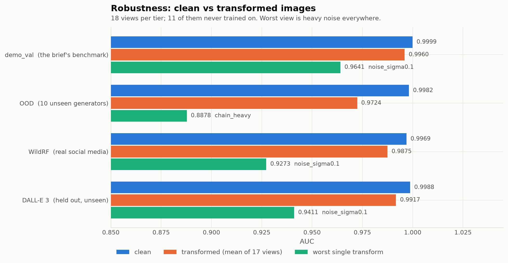

<p align="center"></p>

# (For judges) See [here](#usage-to-infer-predictions-from-a-directory-of-images) to run  the script on a directory of images to produce predictions in a json file and [here](#setup-and-installation) on setting up the model (will download a 1.4Gb backbone model from huggingface)

To get a prediction, install dependencies and then run the predict script

```python
uv sync  # install dependenecies
uv run python predict.py --input_dir path/to/images --output preds.json  # run script and output preds.json
```

`preds.json` is a JSON array, ordered deterministically by POSIX-relative path:

```json
[
  {"image_path": "cat.jpg", "pred": 0.000219},
  {"image_path": "nested/generated.png", "pred": 0.999993}
]
```



demo_val is the validation dataset that includes COCO val2017 and DALL E advanced

# Simplicity, AIGC Image Detection: TikTok TechJam 2026, Track 5

Detecting AI-generated images after JPEG
re-encoding, resizing, blur, noise, colour shifts, and chains of all of those.

A frozen 316M-parameter vision foundation model plus a **1,025-parameter linear
probe**. The backbone is never fine-tuned.

| tier | n | clean AUC | transformed (17-view mean) |
|---|---|---|---|
| `demo_val` — the brief's §5.4 benchmark | 13,843 | **0.9999** | 0.9960 |
| `ood` — 10 generators absent from training | 8,200 | **0.9982** | 0.9724 |
| `wildrf_test` — real Reddit/X/Facebook photos | 2,503 | **0.9969** | 0.9875 |
| `dalle3_holdout` — a modern generator held out entirely | 1,500 | **0.9988** | 0.9917 |

On real social-media photographs at the shipping threshold (0.980):
**2.15% false-positive rate at 97.97% recall**, measured on a held-out split.
The threshold is derived by `scripts/derive_threshold.py`.

---

## Project overview

**Approach.**

```
image → aspect-preserving resize + centre crop to 336px
      → PE-Core-L (frozen, 316M params, no gradients ever)
      → 1024-d pooled embedding → standardise → Linear(1024→1) → P(AIGC)
      → threshold 0.980 → verdict
```

Because the backbone is frozen, every image is embedded **once** and cached then those 
embeddings are directly used to train the linear classifier.

---

## Setup and installation

Requires [uv](https://docs.astral.sh/uv/) and, for anything beyond a handful of
images, an NVIDIA GPU (developed on an RTX 3080, CUDA 13.x). CPU inference works
but is slow.

```bash
uv sync                    # creates .venv, installs torch+cu130 and all deps
uv run main.py check-env   # confirms the GPU is visible; reports dataset status
```

`pyproject.toml` pins PyTorch to the `cu130` wheel index. If your driver needs an
older CUDA, edit `[tool.uv.sources]` / `[[tool.uv.index]]` to e.g. `cu126` and
re-run `uv sync`.

**Always run through uv** (`uv run ...`), never a bare `python`/`pip` — the
pinned CUDA wheel only resolves inside the uv environment.

### Model weights

| piece | size | where it lives |
|---|---|---|
| the trained head (1,025 params) | **19 KB** | committed in `models/` |
| the frozen PE-Core-L backbone | ~1.2 GB | downloaded once from HuggingFace, cached |

The backbone is a public, ungated `timm` checkpoint pulled on first run and cached in
`~/.cache/huggingface/`; subsequent runs are offline. It is **pinned to an exact
revision** (`e63206c8…`), because the decision threshold is calibrated against
those specific weights and a silent upstream re-upload would shift every score
without raising an error anywhere.

**Offline / air-gapped use.** Pre-fetch the weights on a connected machine, then
run with no network at all:

```bash
# once, with network:
uv run python -c "import timm; timm.create_model('hf-hub:timm/vit_pe_core_large_patch14_336.fb@e63206c8e3a0e9b699e40f31080eebd78fd2258e', pretrained=True, num_classes=0)"

# thereafter (or after copying ~/.cache/huggingface to the target machine):
HF_HUB_OFFLINE=1 uv run python predict.py --input_dir path/to/images --output preds.json
```

---

## Usage to infer predictions from a directory of images

Takes an image directory, writes a confidence score per image.

```bash
uv run python predict.py --input_dir path/to/images --output preds.json
# equivalently: uv run main.py predict --input_dir path/to/images --output preds.json
```

`preds.json` is a JSON array, ordered deterministically by POSIX-relative path:

```json
[
  {"image_path": "cat.jpg", "pred": 0.000219},
  {"image_path": "nested/generated.png", "pred": 0.999993}
]
```

`pred` is `P(AIGC)` in `[0, 1]`; closer to 1 means more likely AI-generated.
Recurses subdirectories, accepts jpg/jpeg/png/webp/bmp, and skips unreadable
files with a warning rather than crashing the run. No `--head` argument needed —
it defaults to the shipping checkpoint.

---

## Steps to reproduce training

Data lands in `data/` (gitignored; the tree is stubbed). `main.py check-env`
reports what is actually present at any point.

```bash
# 1. Training data + splits
uv run main.py download tiny-genimage --limit-per-split 40000
uv run main.py split --val-fraction 0.15 --seed 42
uv run python scripts/download_real_domains.py --merge          # real-image domains
uv run python scripts/download_aigc_modern.py --source midjourney-v6 --limit 1500
uv run python scripts/download_aigc_modern.py --source nano-banana  --limit 1500

# 2. Evaluation tiers (never trained on — `split` cannot glob them)
uv run main.py download-demo coco-val2017 && uv run main.py build-demo-val
uv run main.py download-ood --per-generator 250 && uv run main.py build-ood
uv run python scripts/make_wildrf.py
uv run python scripts/download_aigc_modern.py --source dalle3-holdout --limit 1500

# 3. Audit the data BEFORE training (blind-probe shortcut canary)
uv run main.py audit-data --transform

# 4. Cache embeddings — one decode per image, all views
uv run main.py embed-views --backbone pe-core-l --manifest train-ext
uv run main.py embed-views --backbone pe-core-l --manifest val --sample-rows 2000
#   ...repeat per manifest; see `main.py embed-views --help`

# 5. Train the shipping head (seconds, on cached embeddings)
uv run main.py train-head-views --backbone pe-core-l --all-severities \
  --val-sample-rows 2000 --train-manifest train-ext \
  --extra-train-manifest sid-real unsplash-real nano-banana midjourney-v6 \
  --balance --epochs 1 --out models/pe-core-l__linear__allsev_e1.pt

# 6. Evaluate
uv run main.py eval-grid --backbone pe-core-l --manifest ood --sample-rows 4000 \
  --head models/pe-core-l__linear__allsev_e1.pt --by-generator
uv run main.py error-analysis --backbone pe-core-l --manifest ood --sample-rows 4000 \
  --head models/pe-core-l__linear__allsev_e1.pt
```

**`--epochs 1` is deliberate, and validation will not tell you why.** On this
recipe epoch 2 slightly *raises* val AUC_robust (0.9832 → 0.9838). Every held-out
tier disagrees: DALL·E 3 recall 0.958 → 0.942, OOD 17-view recall 0.714 → 0.671.
There is no best-epoch selection in the trainer, so the epoch count is the whole
control. The curve is `stats/charts/02_validation_auc.png`.

**`--all-severities` selects the 19 training views in a fixed order; the rows are 
concatenated view by view, so a different order is a different shuffle and different 
final weights.

Regenerate the charts and stats tables:

```bash
uv sync --extra viz
uv run python scripts/train_instrumented.py    # training curves
uv run python scripts/export_eval_stats.py     # evaluation tables
uv run python scripts/plot_stats.py            # → stats/charts/*.png
```

Every number in this README traces to a CSV in [`stats/`](stats/README.md).

---

## Limitations

1. Only two modern generators were used in the training data set.
2. The model still performs noticably worse at very high noise levels.
3. Still a noticable false positive rate on social media images, false positives also 
 occur with enthusiast style photography (high DOF) which AI tends to mimic too.

Because of the limitations of processing power and using a single RTX 3080 and disk 
space (around 50GB free disk space) to train the model plus time constraints, the 
variety of data that was used was not as extensive as I hoped it to be. The only thing 
I would change in this project would be to massively scale up the volume and diversity 
of training data I had access to to see how well this architecture could perform

---

## Team member contributions

**Solo submission.** All work, data pipeline, corpus audits, model, evaluation
harness, Chrome-extension demo, and writeups, by the repository owner.

---

## Repository map

```
predict.py                 Required inference script (image dir → JSON)
main.py                    CLI for the whole pipeline (`--help` for all commands)
src/aigc_detect/           Library: backbones, transforms, embedding cache, heads,
                             training, eval grid, error analysis, predict
scripts/                   Dataset downloaders, manifest builders, data audit,
                             backbone race, stats export + charting
demo/                      FastAPI server + Chrome extension (live in-page demo)
models/                    The shipping checkpoint (19 KB)
stats/                     Presentation CSVs + charts — see stats/README.md
reports/                   Robustness grids, backbone race, data audit log
data/                      Stubbed; gitignored. `main.py check-env` reports state
